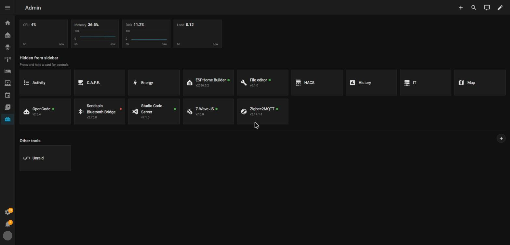

# Admin Toolbox

A Home Assistant dashboard that gathers up the panels you have hidden from
your sidebar - Studio Code Server, Zigbee2MQTT, ESPHome, Z-Wave JS UI and the
rest - and lists them on one admin-only page, reached by a single sidebar
entry.



## What it is

If your sidebar has grown a long tail of add-on entries you rarely look at,
you can hide them and put this dashboard in their place. It shows every
panel you have hidden, plus any links to things outside Home Assistant you
choose to add, plus a strip of system readings.

```
Before                          After
------                          -----
Home                            Home
Overview                        Overview
History                         History
Energy                          Energy
Settings                        Settings
Developer tools                 Developer tools
Studio Code Server              Admin
Zigbee2MQTT
ESPHome
Z-Wave JS UI
File editor
Terminal
```

## How it works

Home Assistant already lets you hide any sidebar item: press and hold the
"Home Assistant" title at the top of the sidebar, then drag the items you
don't want into the hidden area that appears. This dashboard reads that same
hidden list and shows it back to you as a page of cards. Hiding is done per
user, so each person who opens this dashboard sees their own hidden panels,
not anyone else's.

## Install

Add this repository to HACS as a custom repository with the category
**Integration**, install it, then **restart Home Assistant**.

Then go to **Settings > Devices & services**, click **Add integration**, and
choose **Admin Toolbox**. That is the whole setup - the sidebar entry appears
straight away, and there is no dashboard to create and nothing to paste
anywhere.

You can only add it once, on purpose: the page shows the panels *you* have
hidden, so a second copy could only ever show the same thing again.

## Set it up

There is nothing further to do. To change anything, go to **Settings >
Devices & services > Admin Toolbox > Configure**, where you can set:

- the **name** and **icon** shown in your sidebar;
- whether it is **admin only**;
- the two section **headings**;
- how far back the **trend lines** reach;
- which **readings** appear across the top.

Your links are added on the page itself rather than in that form - see below.

### Upgrading from 0.8.0 or earlier

Earlier versions were a dashboard plugin. After installing the integration
and adding it:

1. Copy any links you had configured into the page, using the `+` button.
2. Delete the old dashboard in Settings > Dashboards.
3. Remove its Lovelace resource in Settings > Dashboards > Resources.
4. Delete `www/plugins/admin-toolbox.js` if you put it there by hand.

What you have hidden in your sidebar is untouched throughout. It has never
been stored by this plugin - it lives in your own Home Assistant profile.


## Adding your own links

Under "Other tools" there is a `+` at the right of the heading. It asks for a
name, an address and an icon, and writes the link into the dashboard for you -
there is nothing to edit by hand. Leave the address without `https://` and it
will be added for you.

Press and hold one of your links to edit or remove it, the same gesture the
add-on cards use. Removing asks first.

### App logos

Name a link after the software it points at - "Unraid", "Pi-hole", "Plex" -
and its real logo is filled in for you, from the
[selfh.st icon library](https://selfh.st/icons/). Spelling does not have to be
exact: "pihole" and "Pi Hole" both find Pi-hole. A near miss, such as "syno"
for Synology, is offered as a suggestion to tap rather than filled in - so a
wrong logo never appears without you choosing it. You can also search the
library yourself with "Change", or ignore it and use an ordinary icon.

The library covers self-hosted applications, not everything. Your router,
printer or switch almost certainly has no logo in it, so those keep an
ordinary icon - that is normal, not a failure.

**This reaches the internet.** Looking a logo up, and displaying one
afterwards, fetches from a public content network (jsDelivr). If you would
rather your dashboard spoke only to your own server, use ordinary icons and
nothing is ever fetched. On a machine with no internet access the logo
lookup quietly does not happen and everything else works as normal.

Logos follow your theme, so a dark logo does not vanish into a dark card.

A link with no logo and no icon of your own gets a rounded square with the
initials of its name - "Brother Printer" becomes BP - coloured from the name,
so the same name always looks the same. Type an icon yourself and that is
used instead.

Only an administrator sees the `+` and the edit menu, because only an
administrator can save a dashboard.

## Options

These are the settings behind **Configure**, listed with the names they carry
internally in case you ever meet them in a backup. `extra` is the list the
`+` button on the page writes to, and it is deliberately not in the form -
the page is the better place to edit links.

| Option  | What it does |
| ------- | ------------ |
| `title` | Title shown at the top of the dashboard. |
| `icon`  | Icon shown next to the title. |
| `extra` | A list of links to things outside Home Assistant - your NAS, router, Pi-hole and so on. Each entry is `{name, url, icon}`, and may carry `image` (a picture URL) which is used instead of the icon. These open in a new tab. |
| `hidden_heading` | Heading above the hidden panels. Defaults to "Hidden from sidebar". |
| `extra_heading` | Heading above your own links. Defaults to "Other tools". |
| `stats` | A list of entity ids for the system readings strip. Defaults to processor use, memory use, disk use and load average, where those entities exist on your install. |

### Which icon is which

There is only one icon now, and it is the one in **Configure**. Changing it
changes what you see in the sidebar straight away. The old split between a
dashboard icon and a page icon is gone with the dashboard.

## Using the page

Tap a card to open the tool it represents, in place. Links to things outside
Home Assistant open in a new tab instead.

Press and hold an add-on card to open a menu with Restart, Stop, View logs
and Add-on page. Stop and restart both ask you to confirm before doing
anything. Press and hold one of your own links for Edit and Remove.

## What each tile shows

An add-on card shows its icon, its name, the installed version, a marker
when an update is waiting, and a small dot showing whether it is currently
running.

Anything else you have hidden - a dashboard you never open, a built-in page -
is shown as a plain card with its icon and name. There is no version, dot or
hold menu on those, because there is no add-on behind them.

## Limitations

- The running dot needs a "running" reading that Home Assistant switches off
  by default for every add-on. Until you enable it (Settings > Devices &
  Services > Entities, search for the add-on, and enable its disabled
  entity), no dot is shown for that card. The version number and the update
  marker need nothing enabled and work on a stock install.
- Hide panels using the sidebar editor (press and hold the "Home Assistant"
  title), not the "Show in sidebar" toggle on the add-on's own page. That
  toggle removes the panel from Home Assistant entirely, and a removed panel
  cannot be shown by this dashboard or anything else.
- Restart, stop and start need the add-on supervisor, so they are not
  available on Home Assistant Container. The dashboard still works there;
  those menu entries simply do not appear.
- Add-on details - version, update marker, running dot and controls - need
  an administrator account. A user without admin access sees a plain link
  with none of that.
- This dashboard reads two parts of the Home Assistant frontend that are not
  guaranteed to stay the same between releases. If a future release changes
  them, the page will say so in plain words rather than fail silently, and
  it will need an update at that point.

## Contributing / issues

Bug reports, ideas and pull requests are welcome at https://github.com/Quadcom/admin-toolbox.
